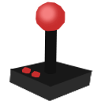

# Freebie Advisor

## Description (Versión en español más abajo)
This Chrome extension alerts users when new video games are released in the market. Stay updated with the latest game releases without any hassle!

## Supported Stores
- Epic Games
- GOG
- Humble Bundle

## Installation Guide
Follow these simple steps to install the extension on your Chrome browser:

1. Download the extension files from the repository.
2. Extract the files to a folder on your computer.
3. Open Google Chrome and go to the menu (three vertical dots) at the top right corner.
4. Select "More tools" > "Extensions".
5. Enable the "Developer mode" toggle at the top right corner.
6. Click on the "Load unpacked" button.
7. Navigate to the folder where you extracted the extension files and select the folder.
8. The extension should now be installed and ready to use!

## Usage
Once installed, the extension will monitor the supported stores for new game releases. When a new game is found, the app icon will change from  to , indicating that there are new games available. Click on the extension icon to view the list of newly released games and stay updated with the latest releases in the gaming world!

## Feedback
If you encounter any issues or have suggestions for improvements, feel free to [contact us](mailto:mattcoder.contact@gmail.com). Your feedback is highly appreciated!

# Español

## Descripción
Esta extensión para Chrome alerta a los usuarios cuando se lanzan nuevos videojuegos en el mercado. ¡Mantente actualizado con los últimos lanzamientos de juegos sin ningún problema!

## Tiendas Compatibles
- Epic Games
- GOG
- Humble Bundle

## Guía de Instalación
Sigue estos sencillos pasos para instalar la extensión en tu navegador Chrome:

1. Descarga los archivos de la extensión desde el repositorio.
2. Extrae los archivos en una carpeta en tu computadora.
3. Abre Google Chrome y ve al menú (tres puntos verticales) en la esquina superior derecha.
4. Selecciona "Más herramientas" > "Extensiones".
5. Habilita el interruptor "Modo desarrollador" en la esquina superior derecha.
6. Haz clic en el botón "Cargar sin empaquetar".
7. Navega hasta la carpeta donde extrajiste los archivos de la extensión y selecciona la carpeta.
8. ¡La extensión ahora debería estar instalada y lista para usar!

## Uso
Una vez instalada, la extensión monitoreará las tiendas compatibles en busca de nuevos lanzamientos de juegos. Cuando se encuentre un nuevo juego, el ícono de la aplicación cambiará de  a (icon_alert128.png), indicando que hay nuevos juegos disponibles. ¡Haz clic en el ícono de la extensión para ver la lista de juegos recién lanzados y mantente actualizado con los últimos lanzamientos en el mundo de los videojuegos!

## Comentarios
Si encuentras algún problema o tienes sugerencias para mejoras, no dudes en [contactarnos](mailto:mattcoder.contact@gmail.com). ¡Tu opinión es muy apreciada!
